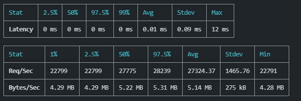

# Background
Next.js provides [custom server feature](https://nextjs.org/docs/advanced-features/custom-server). So I wondered how much performance improvements we can get from custom server with [Fastify](https://www.fastify.io/) which is a fast implementation of HTTP server on Node.js.

# Conclusion
Fastify does not improve req/sec of page servings but do improve req/sec of API. If server allow to use [Node.js cluster feature](https://nodejs.org/api/cluster.html), it improves page serving too.

# Implementations with Fastify
I prepared 3 implementations.

- **As-is**. Not changing anything but adding small API code.
- **Fastify**. Run Next.js on Fastify custom server.
- **Fastify cluster**. Run Fastify custom server on multi-thread.

I do not show the detail of my custom server implementation in this article but you can check on my [Github repository](https://github.com/ku6ryo/next-fastify-benchmarking).

# Page serving
I did not change any code provided by [create-next-app](https://nextjs.org/docs/api-reference/create-next-app) for page serving. I measured req/sec the 3 implementation with [autocannon](https://www.npmjs.com/package/autocannon).

**Fasitfy is 0.87 times of As-is. Fastify cluster is 2.9 times of As-is.**

This says that if you want to use Next.js for page serving purpose, you should NOT use Fastify custom server. However, if you can use Node.js cluster, it's worth to use Fastify (or may be other HTTP server implementation).

*Please note that if you run Next.js on Docker, cluster does not improve or even worsen the performance.*

## As-is

## Fastify

## Fastify cluster

# API serving
I added an API just serving a simple JSON `{ message: "hello" }` to GET requests. For the as-is implementation, I created in the manner of Next.js (Created `pages/api/test.ts`). For other two implementations, I used Fasitfy routing ([detail](https://github.com/ku6ryo/next-fastify-benchmarking/blob/main/fastify/index.ts#L9)).

**Fastify showed 4.14 times of As-is' req / sec and Fastify cluster showed 5.63 times of As-is.**

Considering the result of page serving, if your app uses much API requests from browser comparing to page transition requests, you may use Fastify custom server without cluster even page serving performance is worse than As-is implementation. If you can use Node.js cluster, of course it's worse to use Fastify.
## As-is

## Fastify

## Fastify cluster

# Setup
- OS: Windows 11 Pro
- CPU: Intel(R) Core(TM) i9-9900K CPU @ 3.60GHz (8 cores / 16 logical processors)
- RAM: 32 GB

# Appendix A: API serving in a manner of Next.js with Fastify

Fastify shows 0.80 times of As-is req / sec. Fastify cluster shows 2.31 times of As-is.

## As-is

## Fastify

## Fastify cluster

# Appendix B: Page serving on Docker
I checked performances of Docker environments. Fastify cluster does not improve performance. Fastify shows 0.85 times of As-is req / sec and Fastify cluster shows 0.83 times of As-is (It's even worse !).

## As-is

## Fastify

## Fastify cluster
